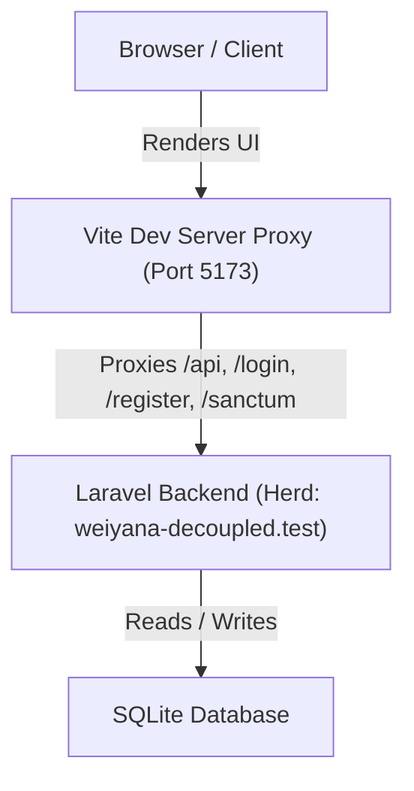
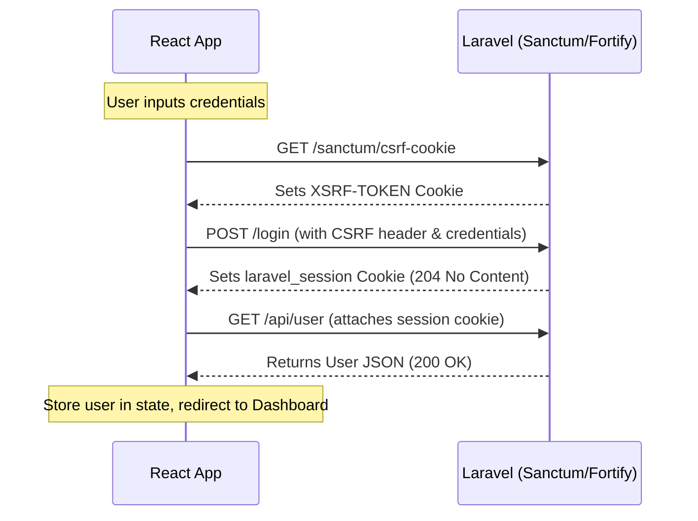

# 🏗️ Project Overview

This system is built as a **decoupled web application** combining a PHP Laravel backend and a React frontend. The codebase resides in a single monorepo with the React app nested as a subproject.

---

## 🏛️ System Architecture

1.  **Backend (Laravel)**: Acts as a stateless/stateful API provider, handling user authentication, business logic, and database access. Hosted locally under `http://weiyana-decoupled.test` (via Laravel Herd).
2.  **Frontend (React + Vite)**: A typescript SPA hosted in `weiyana-react-frontend/`.
3.  **Proxying**: To prevent CORS issues during local development, the Vite server proxies requests starting with `/api`, `/sanctum`, `/login`, `/register`, and `/logout` to the backend URL (`http://weiyana-decoupled.test`).

---

## 🔑 Authentication Architecture (Sanctum + Fortify)

The application uses stateful, cookie-based session authentication rather than bearer tokens. This is highly secure and handles CSRF protection natively.

### 🔄 Authentication Lifecycles

#### 1. Checking Session State
Upon app load, the frontend checks if a valid session already exists:
1.  Sends a `GET` request to `/api/user`.
2.  If it returns `200 OK`, the user object is stored in the React context, and they are redirected to `/dashboard`.
3.  If it returns `401 Unauthorized`, the user is treated as a guest and redirected to `/login`.

#### 2. User Sign-In (Login Flow)
When a guest logs in:
1.  **CSRF Initialization**: The client calls `GET /sanctum/csrf-cookie` to obtain a fresh CSRF token set by Laravel in an `XSRF-TOKEN` cookie.
2.  **Authentication Request**: The client sends a `POST /login` containing `email` and `password`. The Axios interceptor automatically attaches the `X-XSRF-TOKEN` header.
3.  **User State Retrieval**: Upon successful authentication, the client fetches the authenticated user's details from `GET /api/user` and stores them in state.

#### 3. Registration Flow
Similar to the login flow:
1.  `GET /sanctum/csrf-cookie` to fetch CSRF cookies.
2.  `POST /register` with `name`, `email`, `password`, and `password_confirmation`.
3.  `GET /api/user` to verify user context.

#### 4. Sign-Out (Logout Flow)
1.  `POST /logout` is called.
2.  Laravel clears the session cookie.
3.  Frontend clears the user state and redirects to `/login`.

---

## 🛰️ Axios Configuration

The custom axios instance is defined in [axios.ts](file:///c:/Users/PC/Herd/weiyana-decoupled/weiyana-react-frontend/src/lib/axios.ts):
*   `withCredentials: true` is enabled to ensure the browser sends cookies (like the Laravel session cookie) with every request.
*   Common headers like `X-Requested-With: XMLHttpRequest` and `Accept: application/json` are added.

---

⬅️ Back to [Home](00_Home.md)
